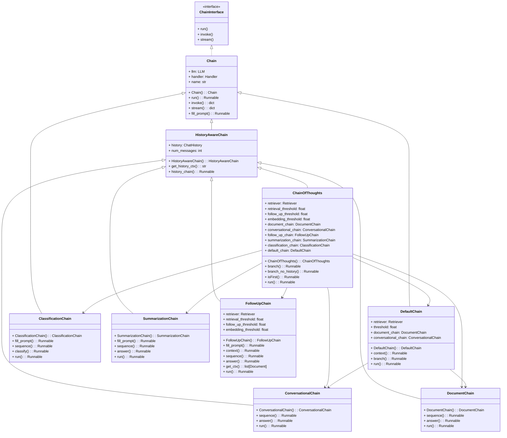

# Chatbot with RAG Functionalities

Made in collaboration with [Drake9098](https://github.com/Drake9098)

This repository contains the code for a chatbot that uses a customised version of the **RAG** model to generate responses.

The chatbot is built using the **Langchain** framework, which is a framework for building conversational AI models.

The RAG model is a retrieval-augmented generation model that uses a retriever to retrieve relevant information from a knowledge source and a generator to generate responses based on the retrieved information.

No data of any kind is included, so you will need to provide your own data.

## ChainOfThoughts

This is a rappresentation of the `ChainOfThoughts` class which is the main chain of execution of the chatbot.

[UML Diagram](chains.md)



## Installation

To install the chatbot, you will need to install the following dependencies:

- `torch`
- `transformers`
- `torchtext`
- `sentence-transformers`
- `dotenv`
- `scikit-learn`
- `requests`
- `bs4`
- `tqdm`
- `faiss-cpu`
- `streamlit`
- All the needed dependencies of the **Langchain** framework

Probably you will need to install also other dependencies, just like **git** to install langchain-cohere (reranker) or **NVIDIA CUDA** to use GPU acceleration.

There is no any `requirements.txt` file, so you will need to install all the dependencies manually.

**OTHER DEPENDENCIES**:

- **Ollama**: I used the `mistral-nemo` model from the **Ollama** library to generate the responses. You can you any other model you want. I can suggest you to use the 8B version of `Llama3.1` model which is a good compromise between performance and computational cost.
You can also download models from the **Hugging Face** model hub and load them on Ollama.
For more information about **Ollama** you can visit the [Ollama official repository](https://github.com/ollama/ollama).

- **Cohere**: I used the **Cohere** API to create a reranker for the RAG model. You can use any other reranker you want. In that case you will need to modify the `retriever` folder to use the new reranker.

- **Streamlit**: I used **Streamlit** to create the chatbot interface. You can use any other interface you want. In that case you will need to modify the `chatbot` folder to use the new interface.

- **Faiss**: I used **Faiss** to create the vectorial database. You can use any other library you want. In that case you will need to modify the `retriever` folder to use the new library.

- **Langchain**: I used the **Langchain** framework to build the chatbot. You can use any other framework you want. In that case you will need to modify the `chatbot` folder to use the new framework.
For more information about **Langchain** you can visit the [Langchain Documentation](https://python.langchain.com/v0.2/docs/introduction/).

## Usage

You have to build your own **Vectorial Database** and you can do it using the `main.py` script in the `retriever` folder.

You have to specify the paths to the data you want to use to build the database and the path to the database you want to create. All the paths are specified in the `config.yaml` file, but you also need to create a `DataList` object in the `main.py` script. to load the data.

**Note**: It is important to create a `.env` file in the `retriever` folder with the following variables before running the `main.py` script:

```
COHERE_API_KEY='your_api_key'
```
---
After creating the database, you can use the `start.bat` script in the `chatbot` folder to interact with the chatbot.

If you are using a Linux system, you can create the `start.sh` script instead of the `start.bat` script by following the same steps.

Otherwise is sufficient to run the following command in the terminal:

```
streamlit run main.py
```

**Note**: It is important to create a `.env` file in the `chatbot` folder with the following variables before running the `main.py` script:

```
COHERE_API_KEY='your_api_key'
```

I used an **Ollama** model to generate the responses, but you can use any other model you want. In that case remember to modify the `config.yaml` file in the `chatbot` folder and to include any possible API key in the `.env` file.

You can also use a model directly from the **Hugging Face** model hub.