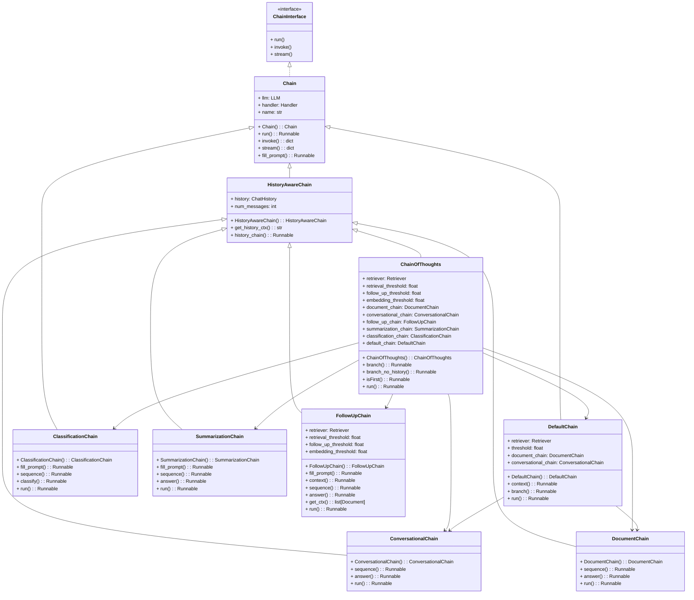

```mermaid
classDiagram
    class ChainInterface {
        <<interface>>

        + run()
        + invoke()
        + stream()
    }

    class Chain {
        + llm: LLM
        + handler: Handler
        + name: str

        + Chain(): Chain
        + run(): Runnable
        + invoke(): dict
        + stream(): dict
        + fill_prompt(): Runnable
    }

    class HistoryAwareChain {
        + history: ChatHistory
        + num_messages: int

        + HistoryAwareChain(): HistoryAwareChain
        + get_history_ctx(): str
        + history_chain(): Runnable
    }

    class ConversationalChain {
        + ConversationalChain(): ConversationalChain
        + sequence(): Runnable
        + answer(): Runnable
        + run(): Runnable
    }

    class DocumentChain {
        + DocumentChain(): DocumentChain
        + sequence(): Runnable
        + answer(): Runnable
        + run(): Runnable
    }

    class DefaultChain {
        + retriever: Retriever
        + threshold: float
        + document_chain: DocumentChain
        + conversational_chain: ConversationalChain

        + DefaultChain(): DefaultChain
        + context(): Runnable
        + branch(): Runnable
        + run(): Runnable
    }

    class ClassificationChain {
        + ClassificationChain(): ClassificationChain
        + fill_prompt(): Runnable
        + sequence(): Runnable
        + classify(): Runnable
        + run(): Runnable
    }

    class SummarizationChain {
        + SummarizationChain(): SummarizationChain
        + fill_prompt(): Runnable
        + sequence(): Runnable
        + answer(): Runnable
        + run(): Runnable
    }

    class FollowUpChain {
        + retriever: Retriever
        + retrieval_threshold: float
        + follow_up_threshold: float
        + embedding_threshold: float

        + FollowUpChain(): FollowUpChain
        + fill_prompt(): Runnable
        + context(): Runnable
        + sequence(): Runnable
        + answer(): Runnable
        + get_ctx(): list[Document]
        + run(): Runnable
    }

    class ChainOfThoughts {
        + retriever: Retriever
        + retrieval_threshold: float
        + follow_up_threshold: float
        + embedding_threshold: float
        + document_chain: DocumentChain
        + conversational_chain: ConversationalChain
        + follow_up_chain: FollowUpChain
        + summarization_chain: SummarizationChain
        + classification_chain: ClassificationChain
        + default_chain: DefaultChain

        + ChainOfThoughts(): ChainOfThoughts
        + branch(): Runnable
        + branch_no_history(): Runnable
        + isFirst(): Runnable
        + run(): Runnable
    }

    ChainInterface <|.. Chain
    Chain <|-- HistoryAwareChain
    HistoryAwareChain <|-- ConversationalChain
    HistoryAwareChain <|-- DocumentChain
    Chain <|-- DefaultChain
    Chain <|-- ClassificationChain
    HistoryAwareChain <|-- SummarizationChain
    HistoryAwareChain <|-- FollowUpChain
    HistoryAwareChain <|-- ChainOfThoughts

    ChainOfThoughts --> ConversationalChain
    ChainOfThoughts --> DocumentChain
    ChainOfThoughts --> FollowUpChain
    ChainOfThoughts --> SummarizationChain
    ChainOfThoughts --> ClassificationChain
    ChainOfThoughts --> DefaultChain

    DefaultChain --> ConversationalChain
    DefaultChain --> DocumentChain
```