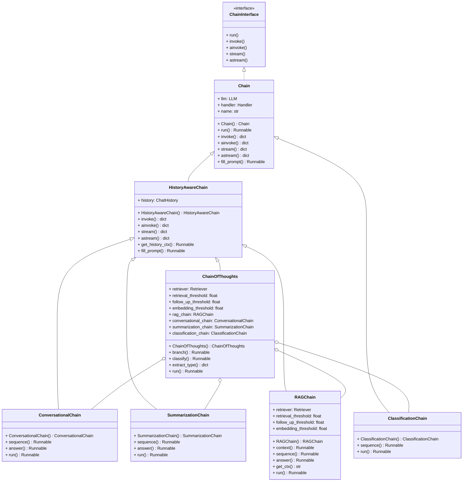

```mermaid
classDiagram
    class ChainInterface {
        <<interface>>
        
        + run()
        + invoke()
        + ainvoke()
        + stream()
        + astream()
    }

    class Chain {
        + llm: LLM
        + handler: Handler
        + name: str

        + Chain() Chain
        + run() Runnable
        + invoke() dict
        + ainvoke() dict
        + stream() dict
        + astream() dict
        + fill_prompt() Runnable
    }

    class HistoryAwareChain {
        + history: ChatHistory

        + HistoryAwareChain() HistoryAwareChain
        + invoke() dict
        + ainvoke() dict
        + stream() dict
        + astream() dict
        + get_history_ctx() Runnable
        + fill_prompt() Runnable
    }
    
    class ConversationalChain {
        + ConversationalChain() ConversationalChain
        + sequence() Runnable
        + answer() Runnable
        + run() Runnable
    }

    class ClassificationChain {
        + ClassificationChain() ClassificationChain
        + sequence() Runnable
        + run() Runnable
    }

    class SummarizationChain {
        + SummarizationChain() SummarizationChain
        + sequence() Runnable
        + answer() Runnable
        + run() Runnable
    }

    class RAGChain {
        + retriever: Retriever
        + retrieval_threshold: float
        + follow_up_threshold: float
        + embedding_threshold: float

        + RAGChain() RAGChain
        + context() Runnable
        + sequence() Runnable
        + answer() Runnable
        + get_ctx() str
        + run() Runnable
    }

    class ChainOfThoughts {
        + retriever: Retriever
        + retrieval_threshold: float
        + follow_up_threshold: float
        + embedding_threshold: float
        + rag_chain: RAGChain
        + conversational_chain: ConversationalChain
        + summarization_chain: SummarizationChain
        + classification_chain: ClassificationChain

        + ChainOfThoughts() ChainOfThoughts
        + branch() Runnable
        + classify() Runnable
        + extract_type() dict
        + run() Runnable
    }

    ChainInterface <|.. Chain

    Chain <|-- HistoryAwareChain
    Chain <|-- ClassificationChain

    HistoryAwareChain <|-- ConversationalChain
    HistoryAwareChain <|-- SummarizationChain
    HistoryAwareChain <|-- RAGChain
    HistoryAwareChain <|-- ChainOfThoughts

    ChainOfThoughts o-- ConversationalChain
    ChainOfThoughts o-- RAGChain
    ChainOfThoughts o-- SummarizationChain
    ChainOfThoughts o-- ClassificationChain
```